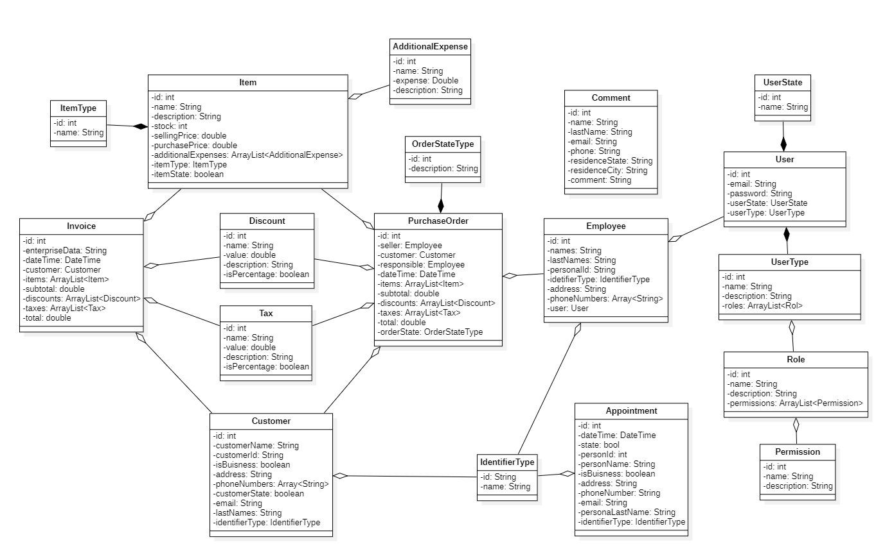
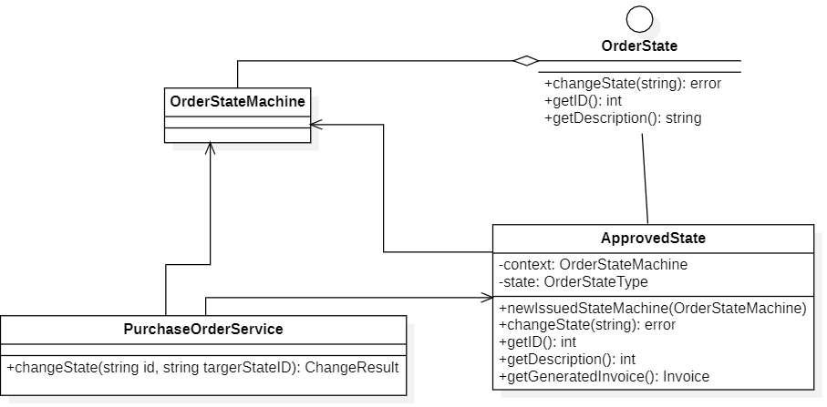
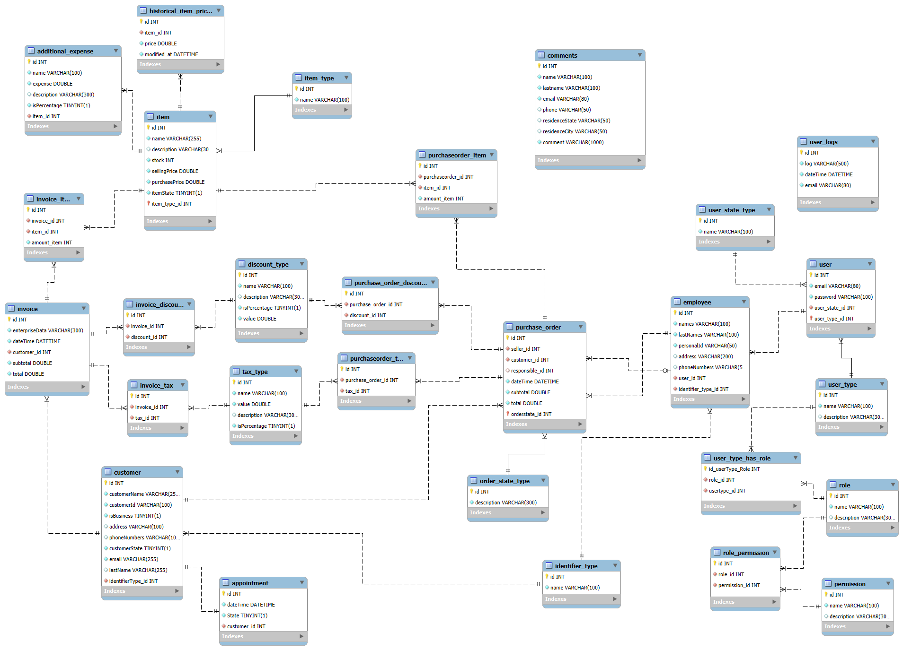

# 🚗 TotesBGA CRM Backend  

**Backend API for the CRM of TotesBGA**, the parent company of a fictional automotive consortium.  
Built with the **Gin framework** in Go and powered by a **PostgreSQL** database.  

This project provides a modular and scalable backend architecture designed to manage users, permissions, inventory, purchases, clients, and appointments across the consortium ecosystem.  

---

## ⚙️ Technologies & Tools  

- **Language & Framework**: Go + Gin  
- **Database**: PostgreSQL (with audit tables)  
- **Security**: bcrypt for password hashing, role & permission system, OpenSSL certificates for HTTPS communication  
- **Patterns & Practices**:  
  - MVC Architecture:  
    - **View** → API routes exposed via the router  
    - **Controller** → Request handling and orchestration  
    - **Model** → Entities definition and Services for business logic  
  - DTOs for API communication  
  - State Machine for purchase orders  
  - Logging & Auditing  

---

## 🏗️ Architecture (MVC)  

The project follows the **Model–View–Controller (MVC)** architecture:  

- **View** → The **routes** exposed by the Gin router, which serve as entry points to the API.  
- **Controller** → Handles HTTP requests/responses, orchestrates data flow, and formats output.  
- **Model**:  
  - **Service** → Executes the **business logic** of the system.  
  - **Entity Models** → Define the data structures and relationships.  

This structure ensures **separation of concerns**, **maintainability**, and a clear flow of responsibilities.  

---

## 🔐 User Management & Security  

- **Granular Permission System**  
  - **Permission** → Smallest unit of access.  
  - **Role** → Group of permissions.  
  - **UserType** → Collection of roles.  
  - **User** → Linked to a `UserType`.  

- **Authentication & Password Security**  
  - Passwords stored securely with **bcrypt hashing**.  
  - Role-based and permission-based access control.  

- **Audit Tables** in PostgreSQL track critical modifications (invoices, employees, clients, users, items, purchase orders).  

- **Logging System** records every action performed by a user.  

---

## 📦 Inventory & Transactions  

- **Inventory Management**  
  - Items include **purchase price**, **selling price**, and additional expenses.  
  - **Historical Item Price** system to register every price change (maintained by backend).  

- **Purchase Module**  
  - **Invoice** → Issued once a purchase is registered (public or inter-company).  
  - **Purchase Order** → Manages inter-company transactions within the consortium.  
    - Controlled with a **State Machine** to handle transitions between order states.  

---

## 👥 Clients & Appointments  

- **Client Module** → Manage customer information.  
- **Appointment Module** → Assign and manage appointments linked to clients.  

---

## 🌐 API  

All modules are exposed through a **RESTful API built with Gin**.  
- Endpoints for **User Administration, Clients, Appointments, Inventory, Purchases, Permissions, and others**.  
- DTOs ensure structured and validated request/response handling.  

# 📘 Documentation  

This project includes visual diagrams and spreadsheets to better understand the system’s architecture and functionality.  

## 🏗️ Class Diagram  
  

## 🔄 Purchase Order State Machine  
  

## 📊 Database Schema  
  

## 👥 Roles & Permissions  
The system implements a **granular user permission model** with `Permissions`, `Roles`, and `User Types`.  
A detailed definition of these roles and permissions can be found in the following spreadsheet:  
[Google Spreadsheet – Roles & Permissions](https://docs.google.com/spreadsheets/d/11m102lqUJTmU0siZoBioVnoCZNL1aB6UESGzQxuqE8w/edit?usp=sharing)

